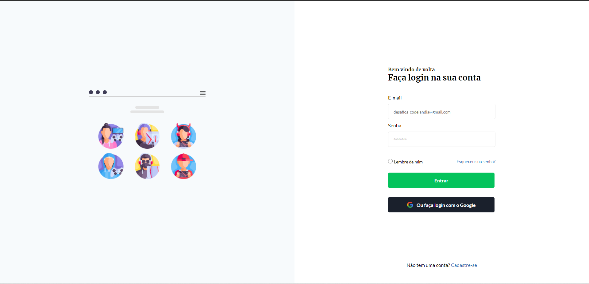

# Tela de login baseado no desafio 04 da Codelândia

 - A proposta do desafio era criar uma tela de login responsiva dividida em duas colunas, o lado da esquerda com uma imagem e o lado direito com o login em si.
 -  Na responsividade, os breakpoints ficaram para notebook, tablet e mobile.
 - Foram usadas as tecnologias HTML E CSS.

 